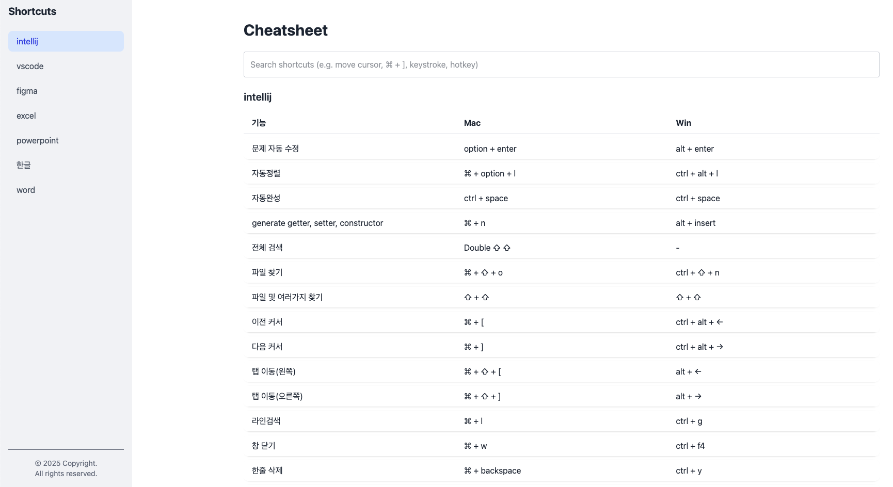

# Shortcut Repository

온보딩 및 협업을 위해 프로그램별 단축키 검색을 지원하는 프로젝트입니다. 한글, 영어 그리고 key stroke로 검색이 가능합니다.

배포된 웹은 [링크](https://shortcut-cheatsheet.vercel.app/)에서 확인해주세요. ([관련포스팅](https://ydj515.github.io/posts/shortcut/))



지원되는 프로그램 목록은 다음과 같습니다.

- Intellij
- vscode
- figma
- powerpoint
- excel
- word
- 한글

## usage

1. 왼쪽 사이드바에서 원하는 카테고리(Figma 또는 IntelliJ)를 선택합니다.
2. 검색창에서 다음 방법으로 검색할 수 있습니다:
   - 텍스트로 검색 (예: "자동완성", "컴포넌트" 등)
   - 단축키 조합으로 검색 (예: ⌘ + N, Ctrl + Space 등)
3. 검색 결과는 실시간으로 업데이트됩니다.

## environment

- React 19
- TypeScript
- Tailwind CSS 4
- Vite / Vitest

## prerequisite

- Node.js 20 (최신 LTS 버전 권장)
- npm

## project setup

```sh
npm install
```

### run dev

```sh
npm run dev
```

### build

```sh
npm run build
```

### test

```sh
npm run test # npx vitest
```

## 단축키 데이터 구조

```typescript
interface Shortcut {
  category: 'figma' | 'intellij';
  action: string;
  mac: string;
  win: string;
  keywords: string[];
}
```

## 프로젝트 구조

```
/
├── public/ # 정적 파일 (favicon, manifest.json 등)
├── src/ # 소스 코드
│   ├── components/ # 리액트 컴포넌트
│   ├── data/ # 단축키 데이터
│   ├── types/ # 타입스크립트 타입 정의
│   ├── utils/ # 유틸리티 함수
│   ├── App.tsx # 메인 애플리케이션 컴포넌트
│   ├── main.tsx # 애플리케이션 진입점
│   └── index.css # 전역 스타일
├── package.json # 프로젝트 의존성 및 스크립트
├── vite.config.ts # Vite 설정 파일
└── tsconfig.json # 타입스크립트 설정 파일
```
