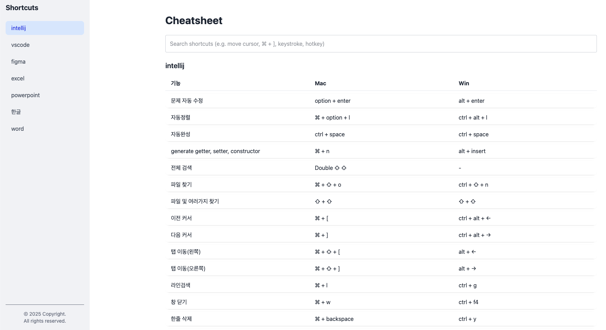

# Shortcut Repository

온보딩 및 협업을 위해 프로그램별 단축키 검색을 지원하는 프로젝트입니다. 한글, 영어 그리고 key stroke로 검색이 가능합니다.

배포된 웹은 [링크](https://shortcut-cheatsheet.vercel.app/)에서 확인해주세요. ([관련포스팅](https://ydj515.github.io/posts/shortcut/))



지원되는 프로그램 목록은 다음과 같습니다.

- Intellij
- vscode
- figma
- powerpoint
- excel
- word
- 한글

## usage

1. 왼쪽 사이드바에서 원하는 카테고리(Figma 또는 IntelliJ)를 선택합니다.
2. 검색창에서 다음 방법으로 검색할 수 있습니다:
   - 텍스트로 검색 (예: "자동완성", "컴포넌트" 등)
   - 단축키 조합으로 검색 (예: ⌘ + N, Ctrl + Space 등)
3. 검색 결과는 실시간으로 업데이트됩니다.

## environment

- React 19
- TypeScript
- Tailwind CSS 4
- Vite / Vitest

## prerequisite

- Node.js 20 (최신 LTS 버전 권장)
- npm

## project setup

```sh
npm install
```

### run dev

```sh
npm run dev
```

### build

```sh
npm run build
```

### test

```sh
npm run test # npx vitest
```

## 단축키 데이터 구조

```typescript
interface Shortcut {
  category: 'figma' | 'intellij';
  action: string;
  mac: string;
  win: string;
  keywords: string[];
}
```

## 프로젝트 구조

```
/
├── public/ # 정적 파일 (favicon, manifest.json 등)
├── src/ # 소스 코드
│   ├── components/ # 리액트 컴포넌트
│   ├── data/ # 단축키 데이터
│   ├── types/ # 타입스크립트 타입 정의
│   ├── utils/ # 유틸리티 함수
│   ├── App.tsx # 메인 애플리케이션 컴포넌트
│   ├── main.tsx # 애플리케이션 진입점
│   └── index.css # 전역 스타일
├── package.json # 프로젝트 의존성 및 스크립트
├── vite.config.ts # Vite 설정 파일
└── tsconfig.json # 타입스크립트 설정 파일
```

## mise 환경과 초기 설정

`mise.toml`은 도구·공통 task, `mise.dev.toml`/`mise.prod.toml`은 공유 환경 선택을 담당한다.

```bash
mise trust ./mise.toml   # task와 overlay를 검토한 뒤 신뢰
mise run bootstrap     # 프로젝트 도구를 명시해 locked 설치 후 의존성 준비
mise run config:check  # task 참조·순환 검사, 앱 실행 없음
mise run verify        # 프로젝트 검증 (Docker 등 기존 검증 전제는 유지)
mise -E dev run verify
```

- 기본 실행은 `APP_ENV=local`, `-E dev`는 개발 overlay, `-E prod`는 운영 설정 선택이다. 환경 선택 자체가 배포나 서비스 시작을 수행하지 않는다.
- 개인 개발 설정은 `mise.dev.local.toml.example`을 검토해 `mise.dev.local.toml`로 복사한다. `.env.dev.local`을 만든 뒤 `env._.file`을 활성화하면 dev에서만 읽는다. 기존 개인 파일을 덮어쓰지 않는다.
- `mise.local.toml`은 **모든 환경**에서 로드된다. prod checkout에 개인 override나 개발 dotenv를 두지 않는다. `-E local`은 사용하지 않는다.
- `APP_ENV`는 공통 환경 식별자다. 애플리케이션의 기존 실행·배포 설정은 유지한다.
- Vite 앱의 `build`는 기본/ prod에서 `production`, dev에서 `development` mode를 사용한다. Next.js는 자체 dev/build 모드를 유지한다. `NODE_ENV`를 전역 production으로 설정하지 않아 개발 의존성 설치가 누락되지 않는다.
- `mise.lock`은 도구 잠금이며 npm/pnpm/Gradle 의존성 잠금과 별개다. 버전 변경 시 `mise lock`을 실행하고 diff를 검토한다. CI에서는 동일한 `-E` 선택으로 `mise install --locked` 후 검증한다. 기본 대상은 macOS ARM64와 Linux x64다.
- `mise run bootstrap`은 프로젝트 초기 설정이다. OS package·dotfile·서비스를 관리하는 `mise bootstrap`은 개인 머신 설정에서 별도로 채택한다.
